<p align="center">
  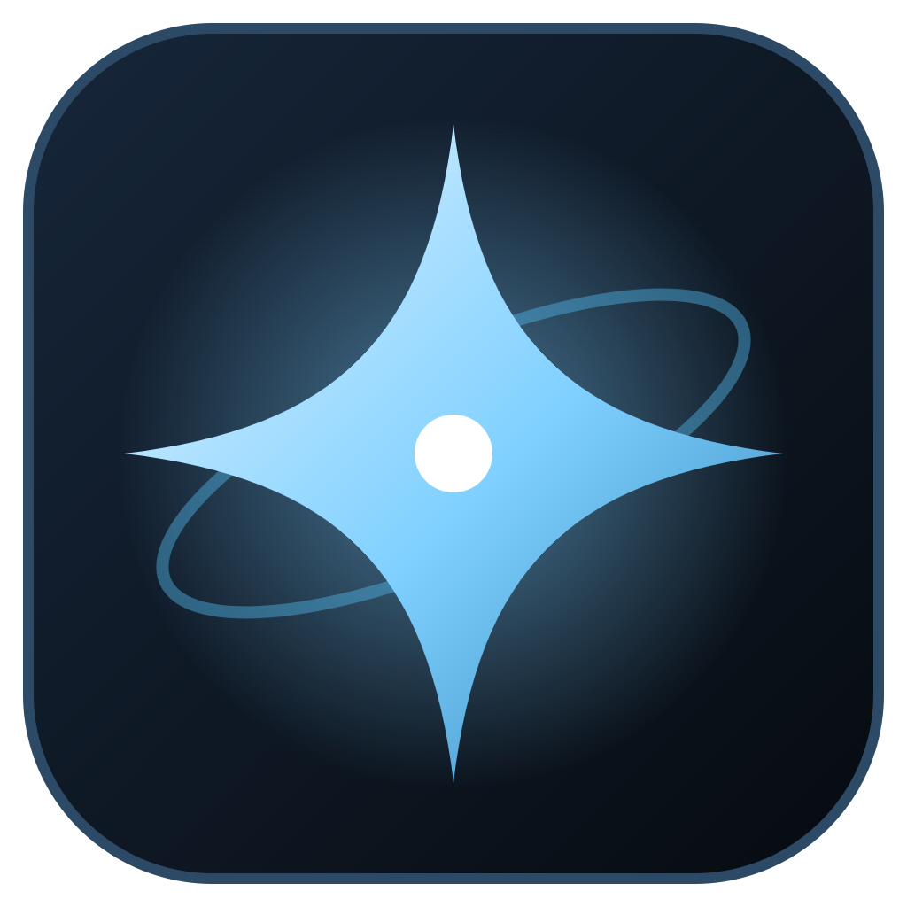
</p>

<h1 align="center">Canopus</h1>

<p align="center">
  A free desktop companion for <b>EVE Online</b>: a fitting tool with its own dogma engine and a combat simulator,
  Local and intel-channel monitoring, route safety, wormholes, market arbitrage, industry and your whole character — in one app for Windows and macOS.
</p>

<p align="center">
  <a href="../../releases/latest"><b>⬇ Download for Windows / macOS</b></a> ·
  English / Русский interface ·
  <a href="LICENSE">MIT</a>
</p>

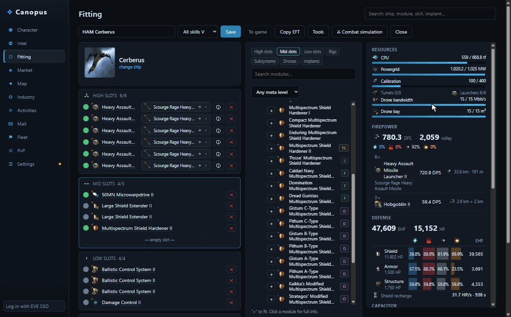

## Features

### A calm, fast interface
- A neutral graphite theme that is easy on the eyes during long sessions; one accent colour marks everything you can click. Pick the accent — Canopus, Photon, Amarr, Caldari, Gallente or Minmatar — and a comfortable or compact density.
- **Ctrl+K** from anywhere: jump to a section, open Show Info for any item, switch the overlay, language or theme.
- Live Tranquility player count and EVE time in the top bar.

### Fitting tool
- Dogma engine driven by CCP's Static Data Export: skills, hull and role bonuses, subsystems, modules (offline / online / active / overheated), charges, drones, implants and stacking penalties.
- Ship browser grouped by class and race, and a module browser grouped like the in-game market (shield, armor, propulsion, turrets by type…) with T1 / T2 / faction / deadspace / officer badges. Only modules that actually fit the ship are offered; turret and launcher hardpoints are enforced.
- The numbers you check first — DPS, volley, EHP, CPU and powergrid — are always on top; a nearly full powergrid turns amber.
- **Live preview**: hover a module in the list and every stat updates in place with the difference highlighted — compare without fitting.
- Identical modules collapse into one row ("6× Heavy Assault Missile Launcher II"): change state or ammo for all at once.
- Ammo picker grouped by tech level with damage-type icons.
- Firepower with damage profile; hover the DPS to see DPS with reload and the split between weapons and drones. EHP and resistances per layer, active tank, capacitor stability, navigation and targeting.
- Calculate with **all skills V** or with **your character's skills**: what to train and how long it takes.
- Fit cost at Jita prices, side-by-side fit comparison and **popular fits from zKillboard** for the same hull.
- Import / export EFT, open fits from your character, current ship, a killmail or Show Info — and **save a fit straight to your in-game fittings**.

| Fitting | Popular fits | Show Info |
|---|---|---|
| 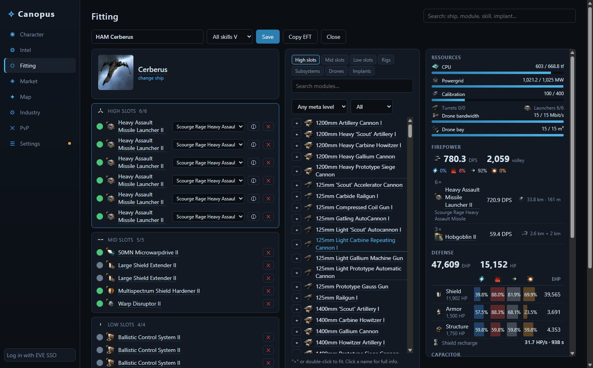 | 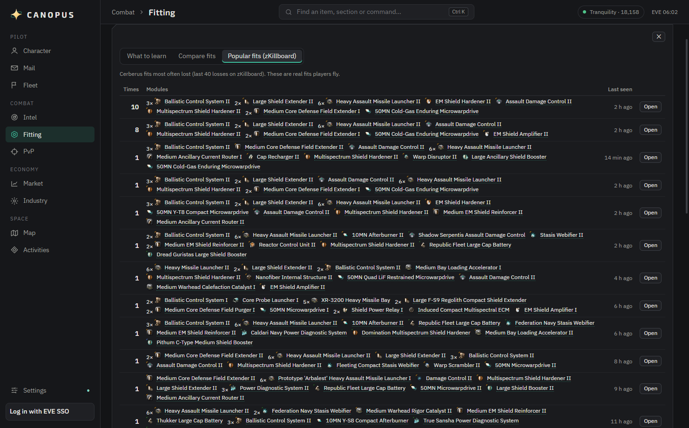 | 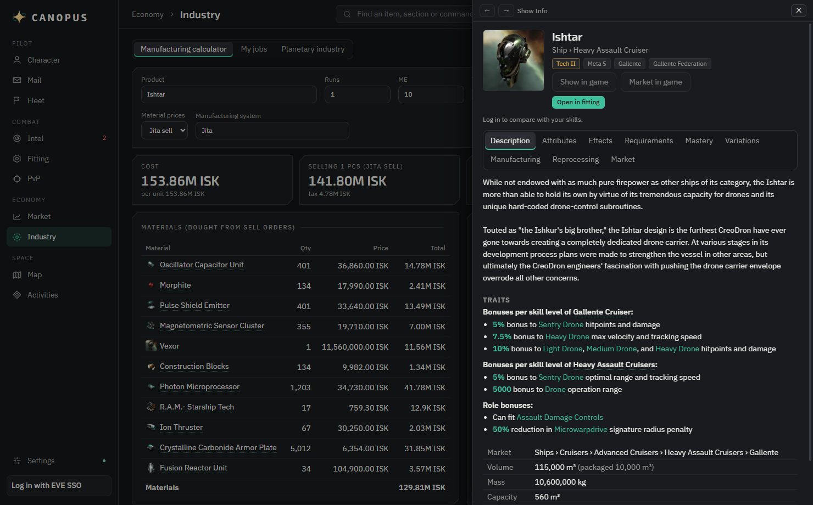 |

### Combat simulator
A separate window that pits your fit against an opponent — any saved fit, one of your in-game fits, or a bare hull.
Drag the ships and velocity vectors on an interactive map (or pick orbiting, head-on, kiting…), switch ammo for both sides,
and see applied DPS for every weapon with the reason it's reduced (tracking, falloff, explosion velocity / radius),
damage per tank layer against local repairs, and who dies first.

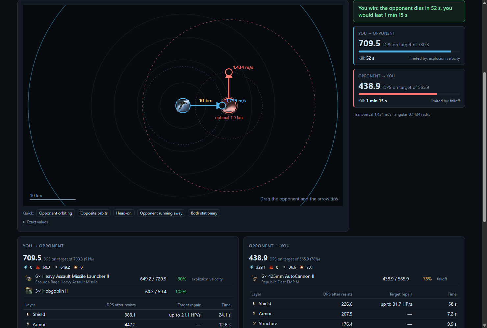

### Intel
- **Local scan** — press **Ctrl+A, Ctrl+C** in the Local window: every pilot is checked for corporation, alliance, age, kills and losses, danger ratio and favourite ships. Threat is shown as a meter with a word, not colour alone. New arrivals are highlighted, and when a dangerous pilot enters you get an alert in the app and a Windows notification.
- **Intel channels** — Canopus follows your alliance's intel chat logs, recognises systems (including shorthand like "1DQ") and ships in every report and shows how many jumps away they are; reports within your range raise an alert, "clr" / "nv" mean all clear.
- **D-scan and fleet window** analysis with warnings for interdictors, bombers, recons, logistics and capitals.
- An always-on-top **overlay** for windowed / borderless mode (**Ctrl+Shift+L** show / hide, **Ctrl+Shift+K** click-through).

| Local scan | Intel channels | Overlay |
|---|---|---|
| 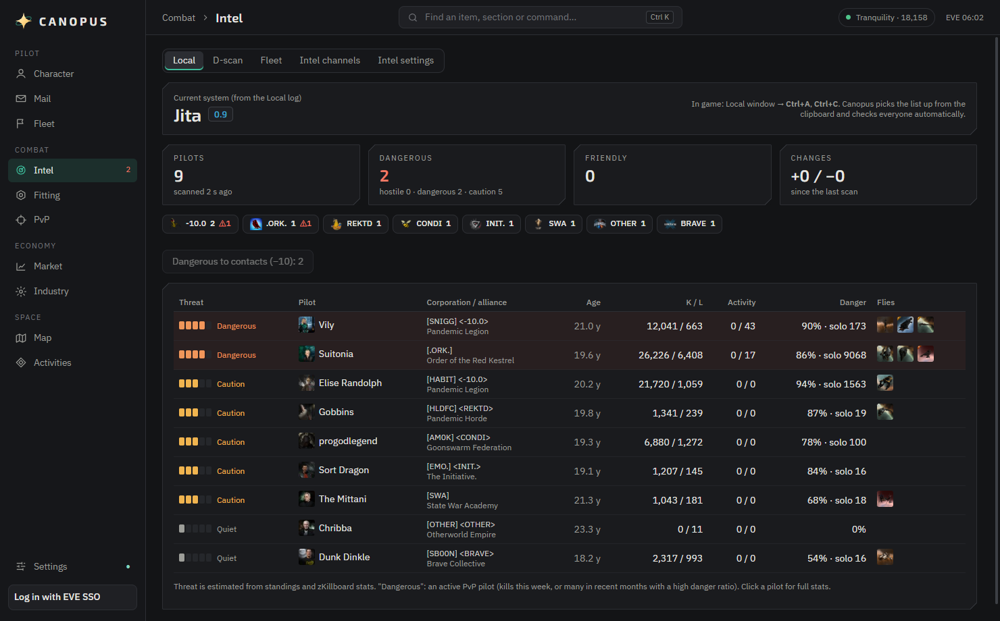 | 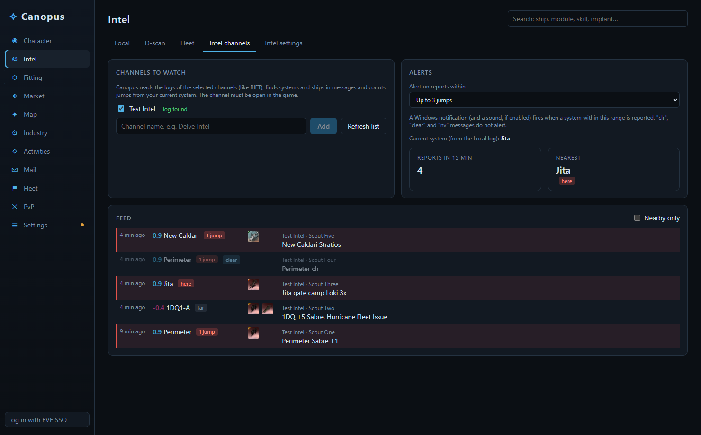 | 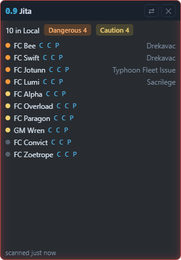 |

### Map and travel
- **Route safety** — every system on the route with security, ship / pod kills in the last hour and gate camps from zKillboard; set the destination in the game with one click.
- **Jump planner** for capitals and black ops: range with your skills, fuel per jump and jump fatigue along a chain of cyno jumps.
- **Wormholes** — look up any hole type (class, lifetime, mass, max jump mass) and how many of your ships can pass. Thera / Turnur connections from EVE-Scout.

| Route safety | Jump planner | Wormholes |
|---|---|---|
| 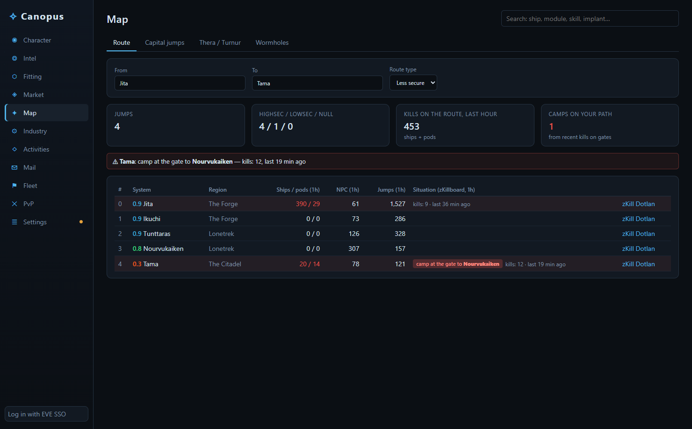 | 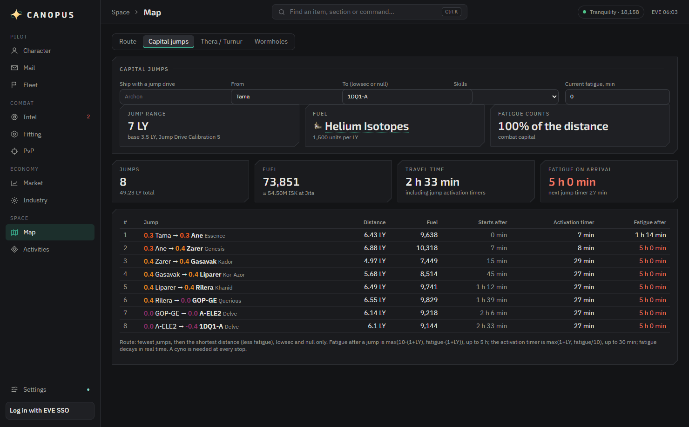 | 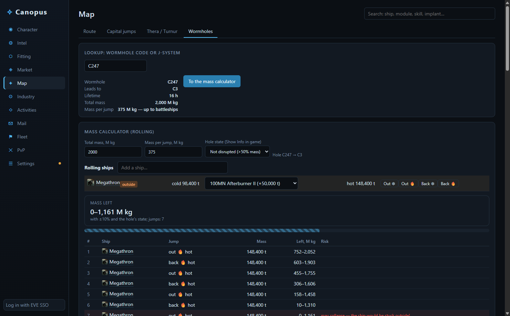 |

### Activities
- **Signatures** — copy the probe scanner and Canopus remembers the signatures per system, marks new and vanished ones and tells what to expect at each site.
- **Ratting** — bounties from the wallet, damage dealt and received from the combat log.
- **Abyss** — a run log with results by tier and by ship.

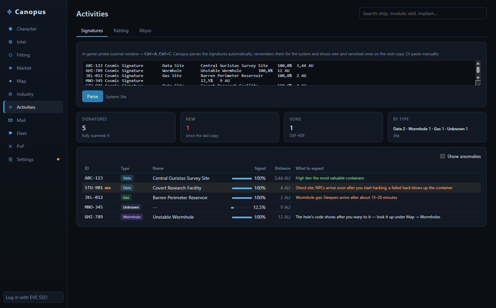

### Market and industry
- Market browser with the in-game category tree, prices in Jita, Amarr, Dodixie, Rens and Hek, the order book and 90-day history.
- **Arbitrage between trade hubs** by market category, with taxes, margin, volume and profit per m³.
- Loot appraisal (English or Russian names), LP store, your orders with outbid detection.
- Manufacturing and reaction calculator (ME / TE, structure bonuses, system cost index, taxes), industry jobs and planetary colonies with extractor timers.

| Arbitrage | Market | Industry |
|---|---|---|
| 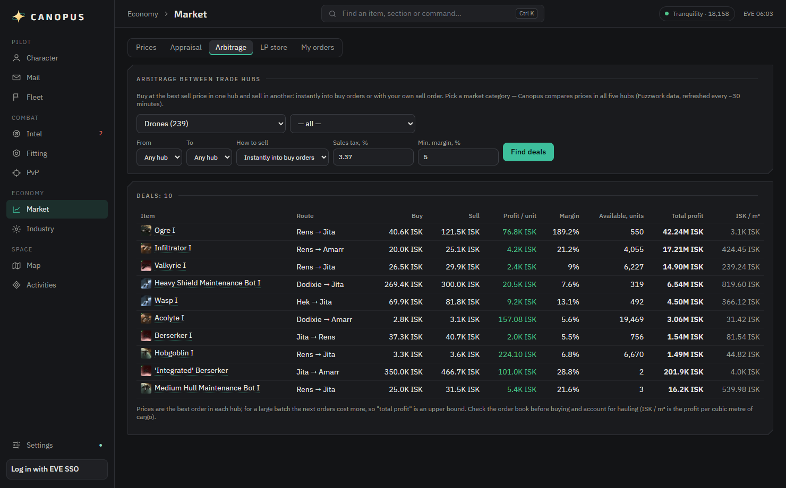 | 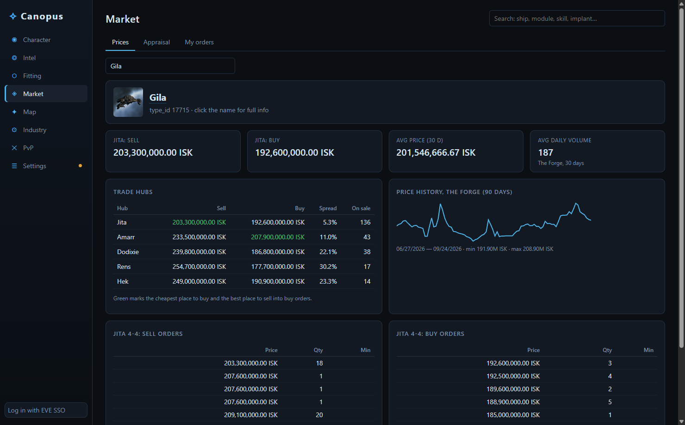 | 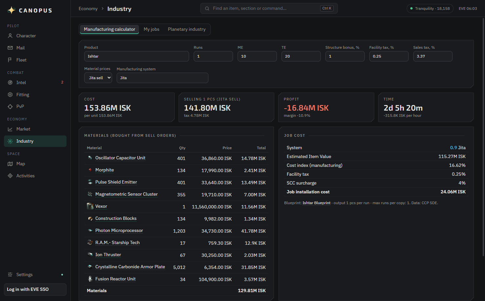 |

### Character, mail and fleet
- Overview, skill queue and a **skill planner**, attributes with implants, jump clones, assets with Jita valuation, blueprints, wallet, contracts, loyalty points, standings and jump fatigue.
- **Contacts**, **calendar**, **EVE mail** and **fleet** management — invite, move and kick members.
- **Tray and Windows notifications** for every character: skill queue running out, PI extractors, finished industry jobs, jump fatigue, outbid market orders, jump clone ready.
- zKillboard statistics and recent fights with the victim's fit.

### In-game actions (optional)
With your permission Canopus acts in the game through CCP's official ESI: opens the market, contract or info window,
sets the destination, saves fits, sends mail, edits contacts, manages the fleet and answers calendar events.
These permissions are requested only when you press **Settings → Allow in-game actions**; otherwise Canopus is read-only.

## Install

Download from [Releases](../../releases/latest):

- **Canopus-Setup-x.y.z.exe** — installer (Start menu and desktop shortcuts).
- **Canopus-x.y.z-portable.exe** — single file, no installation.
- **Canopus-x.y.z-mac.dmg** — macOS 12+ (Apple Silicon and Intel): open it and drag Canopus to Applications.

All builds update themselves: Canopus checks GitHub for new versions, downloads them in the background (verified by SHA-256) and installs on restart. This can be turned off in **Settings → Updates**.

The builds are not code-signed yet, so Windows SmartScreen may warn on first launch: click **More info → Run anyway**.

The macOS build is signed with a Developer ID and notarized by Apple, so it opens without warnings. Move Canopus to Applications and it updates itself like the Windows builds; shortcuts use **Cmd** instead of **Ctrl**.

On first start Canopus downloads CCP's Static Data Export (~95 MB) and builds a local database; it updates itself when CCP publishes a new build. Game icons are fetched from CCP's image server on demand and cached.

## Getting started

1. **Log in with EVE SSO** (bottom left) — CCP's login page opens inside the app. Canopus uses EVE SSO with PKCE; tokens are stored encrypted (Windows DPAPI / macOS Keychain) and never leave your computer.
2. **Settings → Language** switches the interface and item names between English and Russian.
3. For intel, run EVE windowed or borderless, copy Local with **Ctrl+A, Ctrl+C** and choose your intel channels.

## Fair play

Canopus only uses official and player-visible data: CCP's ESI and SDE, the chat and game logs the client writes to your Documents folder, and what you copy to the clipboard yourself. It never reads the game client's memory or screen and never automates input — the same approach as Pyfa or RIFT.

## Data sources

[ESI](https://developers.eveonline.com/) and the Static Data Export (CCP Games) · [zKillboard](https://zkillboard.com/) · [EVE-Scout](https://www.eve-scout.com/) · [Fuzzwork Market](https://market.fuzzwork.co.uk/)

## Building from source

Requires Node.js 22+.

```bash
npm install
npm run dev        # development
npm run typecheck
npm run dist       # installer and portable .exe in release/
```

Stack: Electron, electron-vite, React, TypeScript.

- `src/main` — Electron main process: HTTP cache, EVE SSO, SDE pipeline (`sde/`), dogma engine and combat model (`dogma/`), log and clipboard watchers, notifications, overlay.
- `src/renderer` — React UI; `i18n/` translates the interface on render.
- `src/shared` — types shared across processes.

Questions and ideas: [Discussions](../../discussions) · bug reports: [Issues](../../issues).

## License

[MIT](LICENSE).

EVE Online and all related materials are trademarks or property of CCP hf. Canopus is a third-party application and is not affiliated with or endorsed by CCP hf.
