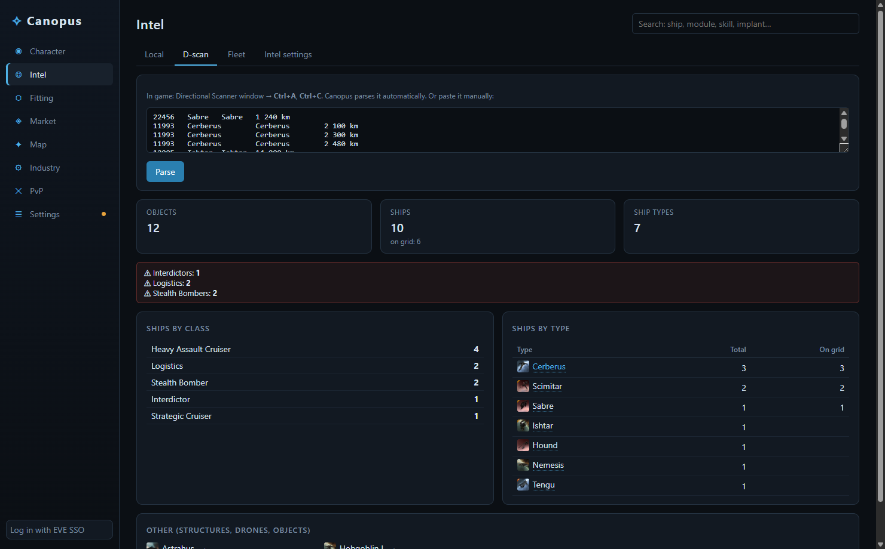
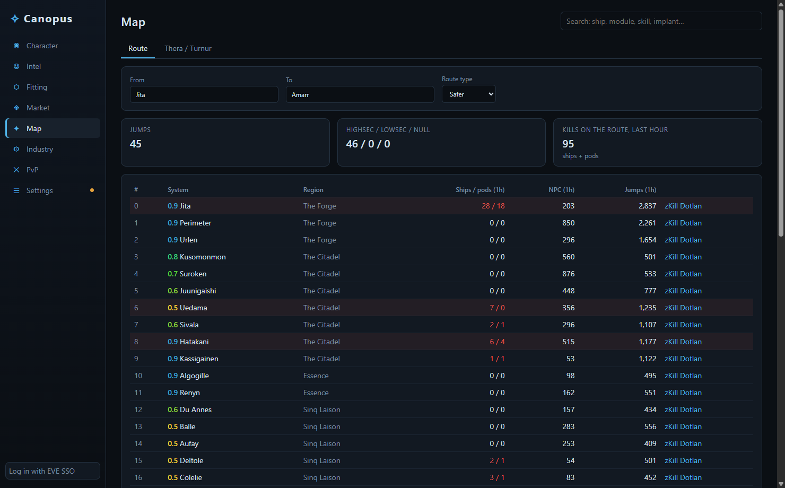

<p align="center">
  
</p>

<h1 align="center">Canopus</h1>

<p align="center">
  A desktop companion for <b>EVE Online</b>: character sheet, a fitting tool with its own dogma engine,
  automatic Local intel with an in-game overlay, market, map and industry — in one Windows app.
</p>

<p align="center">
  <a href="../../releases/latest"><b>Download for Windows</b></a> ·
  English / Русский interface
</p>


## Features

### Fitting tool
- Dogma engine driven by CCP's Static Data Export: skills, hull bonuses, modules (offline / online / active / overheated), charges, drones, implants and stacking penalties.
- Resources, firepower with damage profile, EHP and resistances per layer, active tank, capacitor stability, navigation and targeting.
- Calculate with **all skills V** or with **your character's skills**, with the missing skills and their training time.
- Import / export EFT, save fits, open any fit from your character, current ship, a killmail or Show Info.
- Checked against the in-game fitting window: identical DPS, volley and EHP for a real fit.

### Show Info for everything
Every ship, module, skill, implant and item is clickable and opens a panel like the in-game Show Info: description and traits, dogma attributes with the game's icons, a readable **Effects** tab ("when active: shield resistances +32.5%"), the skill requirement tree with your levels and training time, what a skill unlocks, masteries, variations, blueprints, reprocessing and hub prices.


### Intel: automatic Local scan and overlay
- Press **Ctrl+A, Ctrl+C** in the Local window — Canopus picks the list up from the clipboard and checks every pilot: corporation and alliance, age, kills and losses, recent activity, danger ratio, what they fly.
- Current system is read from the Local chat log; new arrivals are highlighted, leavers listed, and a Windows notification with sound fires when a dangerous pilot enters.
- D-scan and fleet window analysis: ships by class and type, on-grid count, warnings for interdictors, bombers, recons, logistics and capitals.
- Intel channel monitor: pick your alliance's intel channels and Canopus follows their chat logs, finds systems (including shorthand like "1DQ") and ships in every report and shows how many stargate jumps away they are. Reports within your chosen range trigger a notification; "clr" / "nv" are recognised as all-clear.
- An always-on-top overlay for windowed / borderless mode (**Ctrl+Shift+L** show / hide, **Ctrl+Shift+K** click-through).

| Local scan | D-scan | Overlay |
|---|---|---|
|  |  |  |

### Character
Overview, skill queue, all skills, attributes with implants, jump clones, current ship fit, saved fittings, assets with Jita valuation, blueprints, wallet journal and transactions, contracts, loyalty points, standings and jump fatigue (via EVE SSO).

### Market, map, industry, PvP
- **Market** — prices in Jita, Amarr, Dodixie, Rens and Hek, the Jita order book, 90-day history, loot appraisal (English or Russian names) and your orders with outbid detection.
- **Map** — routes with ship / pod kills and jumps per system for the last hour, "set destination" in the game client, Thera / Turnur connections from EVE-Scout.
- **Industry** — manufacturing and reaction calculator (ME / TE, structure bonus, system cost index, taxes, SCC surcharge), industry jobs and planetary colonies with extractor timers.
- **PvP** — zKillboard stats and recent fights; click a fight to see the victim's fit and the attackers.

| Market | Route | Industry |
|---|---|---|
|  |  |  |

## Install

Download from [Releases](../../releases/latest):

- **Canopus-Setup-x.y.z.exe** — installer (Start menu and desktop shortcuts).
- **Canopus-x.y.z-portable.exe** — single file, no installation.

The builds are not code-signed yet, so Windows SmartScreen may warn on first launch: click **More info → Run anyway**.

On first start Canopus downloads CCP's Static Data Export (~95 MB) and builds a local database; it updates itself when CCP publishes a new build. Game icons are fetched from CCP's resource server on demand and cached.

## Getting started

1. **Settings → Add character (EVE SSO)** and log in in your browser. Canopus uses EVE SSO with PKCE; tokens are stored encrypted with Windows DPAPI.
2. **Settings → Language** switches the interface and item names between English and Russian.
3. For intel, run EVE windowed or borderless and copy Local with **Ctrl+A, Ctrl+C**.

## Fair play

Canopus only uses official and player-visible data: CCP's ESI and SDE, the chat logs the game writes to your Documents folder, and what you copy to the clipboard yourself. It never reads the game client's memory or screen and never automates input — the same approach as Pyfa or RIFT.

## Data sources

[ESI](https://developers.eveonline.com/) and the Static Data Export (CCP Games) · [zKillboard](https://zkillboard.com/) · [EVE-Scout](https://www.eve-scout.com/) · [Fuzzwork Market](https://market.fuzzwork.co.uk/)

## Building from source

Requires Node.js 22+.

```bash
npm install
npm run dev        # development
npm run typecheck
npm run dist       # installer and portable .exe in release/
```

Stack: Electron, electron-vite, React, TypeScript.

- `src/main` — Electron main process: HTTP cache, EVE SSO, SDE pipeline (`sde/`), dogma engine (`dogma/`), intel log and clipboard watchers, overlay, icon protocol.
- `src/renderer` — React UI; `i18n/` translates the interface on render.
- `src/shared` — types shared across processes.

## License

[MIT](LICENSE).

EVE Online and all related materials are trademarks or property of CCP hf. Canopus is a third-party application and is not affiliated with or endorsed by CCP hf.
